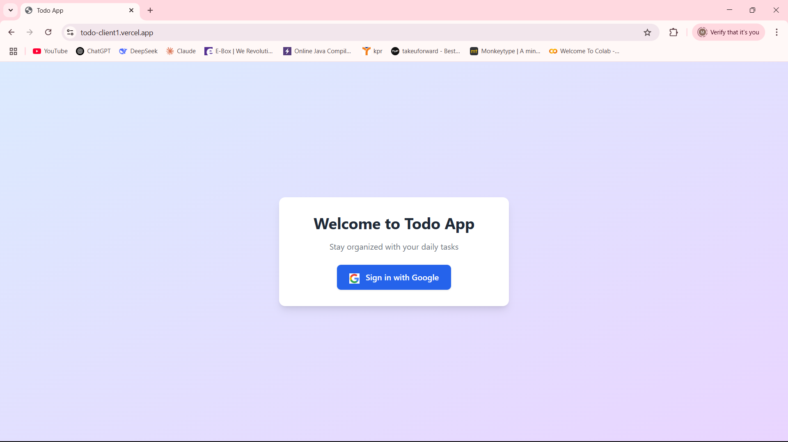
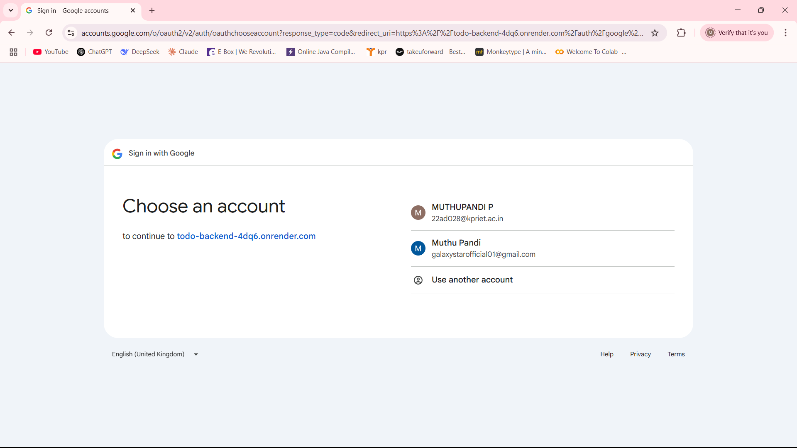
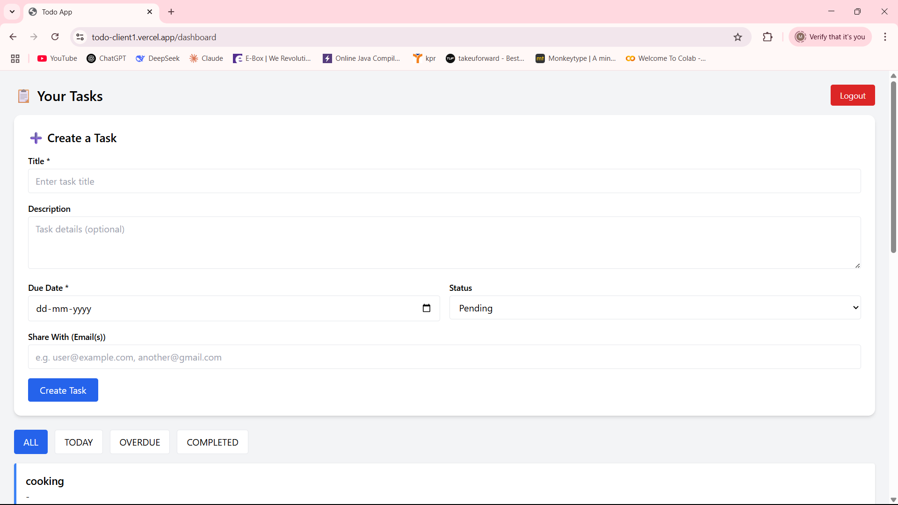
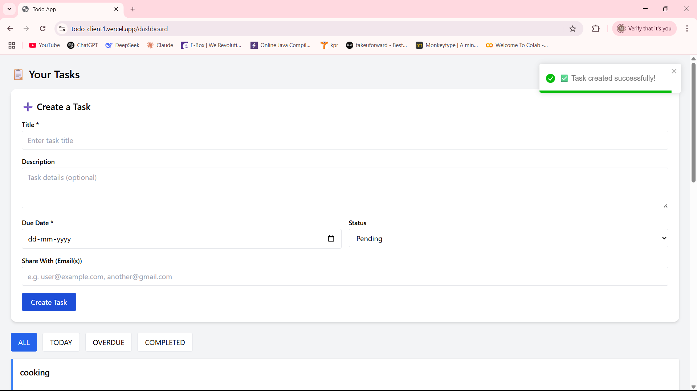
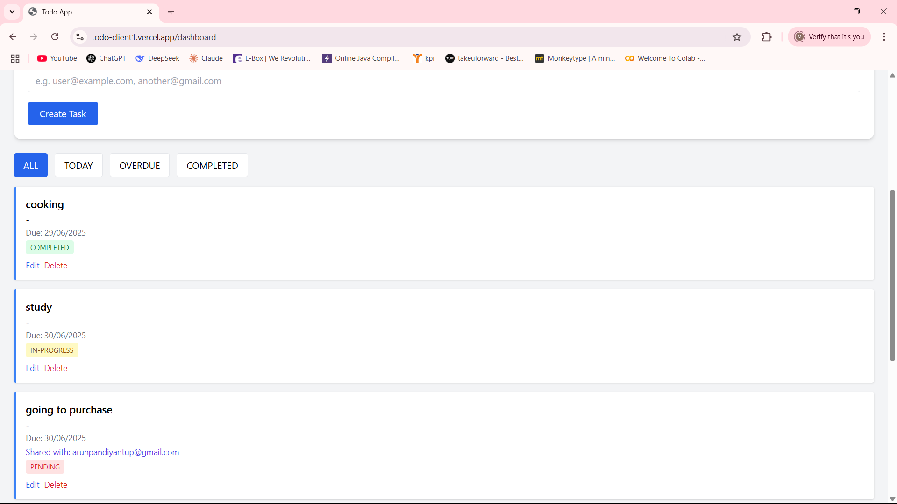
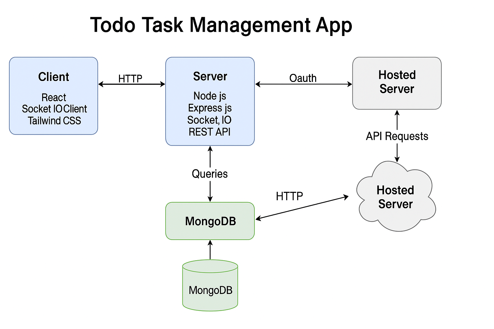

# 📝 Todo Task Management App

This is a full-stack task management web application built with the MERN stack (MongoDB, Express, React, Node.js). It allows users to securely log in with Google, manage tasks, share them with others via email, and see real-time updates.

---

## 🚀 Live App

- **Frontend:** https://todo-client1.vercel.app  
- **Backend:** https://todo-backend-4dq6.onrender.com

---

## 🔐 Features

- Google OAuth login
- JWT authentication and secure routes
- Create, update, delete, and complete tasks
- Filter tasks by All / Today / Overdue / Completed
- Share tasks with others via email
- Real-time task updates using Socket.IO
- Clean, responsive UI with Tailwind CSS

---

## 🧰 Tech Stack

- **Frontend:** React, Tailwind CSS, React Router
- **Backend:** Node.js, Express.js, MongoDB
- **Auth:** Passport.js (Google OAuth), JWT
- **Real-time:** Socket.IO
- **Database:** sql
- **Deployment:** Vercel (Frontend), Render (Backend)

---

## 📸 Screenshots

### 🔐 Google Login Flow

#### Step 1: Login Button

#### Step 2: Google Account Selection

---

### 📋 Dashboard & Task Management

#### View 1: Empty Task List After Login

#### View 2: Task Creation with Toast Notification

#### View 3: Tasks with Filters (All, Today, Overdue, Completed)

---

### 🧩 Architecture Diagram

---

## 🧠 Learnings

- Hands-on OAuth flow using Passport.js
- Using JWT securely across frontend and backend
- Real-time updates using Socket.IO for task sync
- Structuring scalable full-stack apps with the MERN stack
- Deployment best practices with Vercel, Render, and MongoDB Atlas

---

## ✨ Credits

This project is a part of a hackathon run by [https://www.katomaran.com](https://www.katomaran.com)

